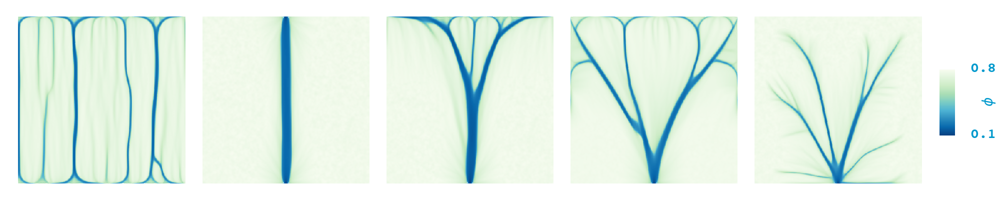

Erosion model
===================

This repository contains a DuMux application for simulating erosion in porous media.
The model is based on the generalized model of dynamics in threshold materials by
Fischer, Tauber, Koch, Mahadevan (2025). The erosion model is similar to the
model described earlier by Derr et al. (2020) Phys. Rev. Lett., [10.1103/PhysRevLett.125.158002](https://doi.org/10.1103/PhysRevLett.125.158002).



The implemented governing equations are

```math
\begin{align}
\kappa \frac{\partial p}{\partial t} - \nabla \cdot \left( K(\phi) \nabla p \right) &= 0, \\
\frac{\partial \phi}{\partial t} - \nabla \cdot \left( D \nabla \phi \right) &= -\phi \mathrm{max}\left\lbrace 0, ||\nabla p||^2 - \sigma^2(g) \right\rbrace, \\
\frac{\partial g}{\partial t} - \nabla \cdot \left( B \nabla g \right) &= k_g (\phi - g),
\end{align}
```

where $\phi$ is the solid volume fraction, $K(\phi) = \frac{(1-\phi)^3}{\phi^2}$,
$\sigma^2(g) = \frac{H(g)-H(0)}{H(1)-H(0)}$ with $H(g) = \frac{1}{2}\left[1 -  \mathrm{tanh}(\omega (g^* - g))\right]$.
We erode when $||\nabla p||^2 > \sigma^2(g)$, where $\sigma^2(g)$ is a yield stress that depends on the solidity $g$.


Installation
=========================

Requirements
--------------

* cmake >= 3.22
* C++20 compliant compiler (e.g g++ >= 11 or clang >= 14)
* pkg-config

Setup
--------------

Make a new folder (e.g. `dumux`) that will contain all modules.
Inside of this folder, clone this repo.
Folder structure would look like this

```
dumux
└───dumux-erosion
```

Then run from the top folder (`dumux`):

```
./dumux-erosion/setup.sh
```

to download Dune/DuMux dependencies and configure and build the project.
The script takes care of this but if you are manually cloning the dependencies
make sure to use that branch.

After that folder structure will look like this:

```
dumux
├───dumux-erosion
│    ├───build-cmake/app
│    ├───app
│    ├───CMakeLists.txt
│    ....
├───dune-common
├───dune-geometry
├───dune-grid
├───dune-istl
├───dune-localfunctions
├───dune-alugrid
└───dumux
```

Applications
=========================

Programs are build and run inside the build folder `build-cmake/app`. The build folder
mimicks the structure of the source folder `app` where you find the header files (source files).

2D example
------------------------------------

Go to `dumux-erosion/build-cmake/app`
and run

Acknowledgement
=========================

The code is based on the [DuMux simulation framework](https://dumux.org/), which
makes use of the [Distributed Unified Numerics Environment (DUNE)](https://www.dune-project.org/).
I/O is efficient and easy due to [GridFormat](https://github.com/dglaeser/gridformat).
Visualizations included in this repo have been made with [ParaView](https://www.paraview.org/).
DuMux-erosion in an application developed by Timo Koch.
